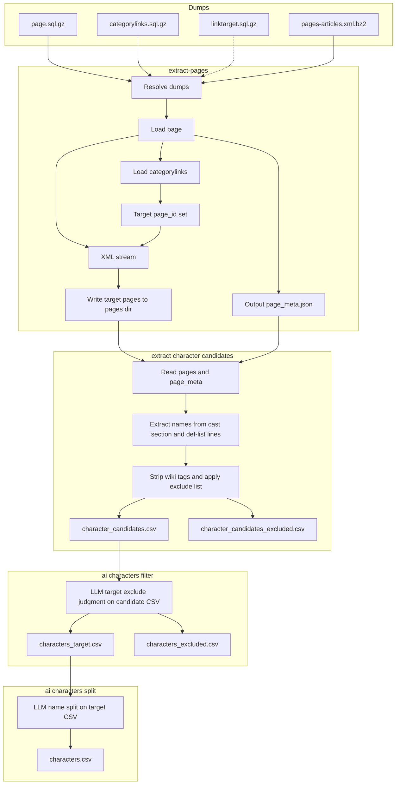
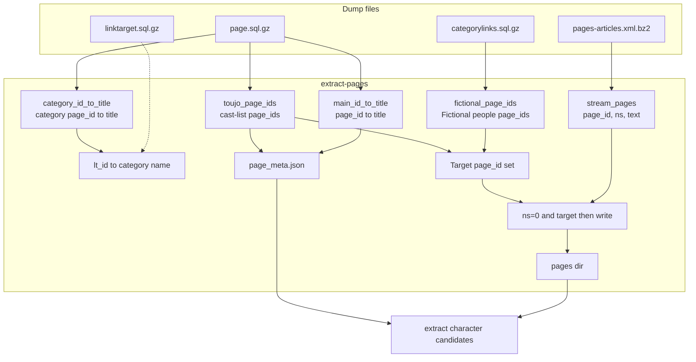
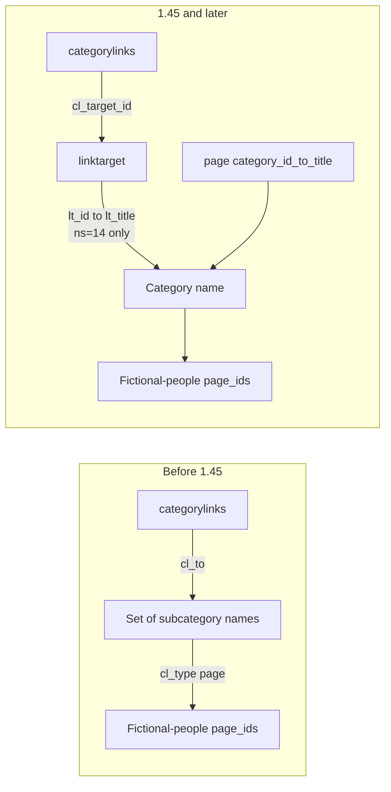
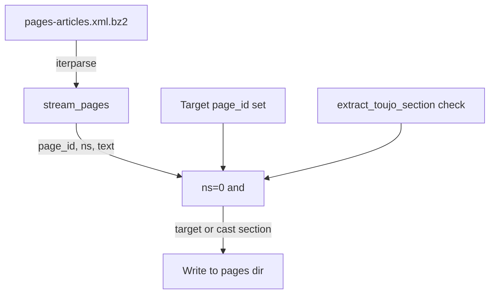

# Pipeline Details and Role of Each Dump

This document describes the pipeline processing and the role and usage of each dump file.

---

## Pipeline Flow

1. **extract-pages**
   - **Resolve dumps** — Search `data_dir` for the three required types (categorylinks, page, pages-articles). linktarget is searched when needed for 1.45+ format.
   - **Page dump** — Build main-namespace `page_id → title`, category `page_id → title`, and the set of page_ids for "○○の登場人物" (cast-list) pages.
   - **Categorylinks dump** — Collect page_ids under the "架空の人物" (Fictional people) category (for 1.45+, resolve `cl_target_id` → category name via linktarget).
   - **Target page_id set** — Union of fictional-people page_ids and cast-list page_ids; plus, during XML stream, any ns=0 page that has an "登場人物" section (detected by `extract_toujo_section`).
   - **XML stream** — Read `(page_id, ns, text)` per page via `iterparse`; write only ns=0 pages that are in the target set or have an "登場人物" section to `pages/{page_id}.txt`.
   - **page_meta.json** — Output `main_id_to_title` and `toujo_page_ids` (used by extract-character-candidates).

2. **extract-character-candidates**
   - **Input** — Output of extract-pages (`pages/` and `page_meta.json`).
   - **Name extraction** — For each page: on cast-list pages use the full body; on normal pages extract the "登場人物" section with `extract_toujo_section()`, then collect candidates from `;` and `:*` lines. Strip wiki templates, links, footnotes with `clean_wiki_content`; split on "、" and "/".
   - **Exclusion** — Apply `excluded_names.json` (exact match and "の" + exact suffix match) and `is_excluded_name` rules (episode titles, voice credits, etc.). Excluded rows are written to `character_candidates_excluded.csv`.
   - **Output** — `character_candidates.csv` (page title, name). Input for ai-characters-filter.

3. **ai-characters-filter (①)**
   - **Input** — `character_candidates.csv`.
   - **Processing** — Send candidate names to the LLM (Ollama / Gemini, etc.) in batches; classify each as "target" (proper-noun character name) or "exclude" per `data/prompts/filter_system.txt`. Adjust status using blacklist, force-exclude, sentence-fragment checks, and proper-noun heuristics.
   - **Output** — `characters_target.csv` (target), `characters_excluded.csv` (exclude). Resumable via progress file.

4. **ai-characters-split (②)**
   - **Input** — ①’s `characters_target.csv`.
   - **Processing** — Send target names to the LLM in batches; split into "family name, given name, is_name flag" per `data/prompts/split_system.txt` and few-shot examples (split_example_input / split_example_output).
   - **Output** — `characters.csv` (page title, character name, family name, given name, is_name flag). Resumable via progress file.

---

## Role and Usage of Each Dump

### Dump and Data Flow (Overview)

---

### 1. `page.sql.gz` (required)

- **Role**
  - **page_id → page_title** for main namespace (ns=0) (`main_id_to_title`).
  - **page_id → page_title** for category namespace (ns=14) (`category_id_to_title`).
  - Set of **page_ids** for pages whose title matches `.+の.+登場人物(_一覧)?$` (e.g. "○○の登場人物", "○○の登場人物一覧") (`toujo_page_ids`).

- **Where used**
  - **wiki_extract/extract/sql_page.py** `run_page()`: reads the dump row-by-row via `mwsql`; stores titles normalized (NFKC, spaces → underscores).
  - **wiki_extract/extract/extract_pages.py**: saves `main_id_to_title` and `toujo_page_ids` to `page_meta.json`; uses them to decide which page_ids to write during XML stream.
  - **wiki_extract/characters/extract_character_candidates.py**: reads `page_meta.json` for page titles and to tell cast-list pages from normal pages.

- **Columns used**
  - `page_id`, `page_namespace`, `page_title`.

---

### 2. `categorylinks.sql.gz` (required)

- **Role**
  - Collect **page_ids** (`cl_from`) of pages under the "架空の人物" (Fictional people) category and its subcategories.
  - Schema depends on MediaWiki version:
    - **Before 1.45**: `cl_to` holds the category name (string).
    - **1.45+**: No `cl_to`; only `cl_target_id`, which corresponds to **linktarget** `lt_id`, so the linktarget dump is required.

- **Where used**
  - **wiki_extract/extract/sql_categorylinks.py** `run_categorylinks()`.
  - Resolve "架空の人物" category page_id from `category_id_to_title` (from page dump).
  - **When `cl_to` exists**: build the set of category names under "架空の人物" by fixed point over `cl_type='subcat'` rows; then collect `cl_from` where `cl_type='page'` and `cl_to` is in that set.
  - **When only `cl_target_id` (1.45+)**: read linktarget dump, build `lt_id → category name` for ns=14; build `lt_id → category page_id` with page; fixed point for subcategory page_ids; then collect `cl_from` where `cl_type='page'` and `cl_target_id` belongs to that set.

- **Columns used**
  - `cl_from`, `cl_type`, `cl_to` (old format), `cl_target_id` (1.45+ format).

---

### 3. `linktarget.sql.gz` (required)

- **Role**
  - Maps **categorylinks** `cl_target_id` (linktarget `lt_id`) to category names (ns=14 titles).
  - Required to resolve `lt_id` → category name and collect page_ids under "架空の人物" when using 1.45+ categorylinks format.

- **Where used**
  - **wiki_extract/extract/sql_categorylinks.py** `_load_linktarget_category_titles()`.
  - Opens the linktarget dump and builds `lt_id → normalized lt_title` for rows with `lt_namespace=14`.
  - Fallback when "架空の人物" is missing due to parse issues: if any cell in a row matches "架空の人物" (via `seed_titles=[CATEGORY_FICTIONAL]`), that row is used.
  - Combines the resulting `lt_id → category name` with page’s `category_id_to_title` to resolve `cl_target_id` to category page_id.

- **Columns used**
  - `lt_id`, `lt_namespace`, `lt_title`.

- **Placement**
  - Required. Place `*linktarget*.sql.gz` in `data_dir`. If missing, categorylinks processing will fail for 1.45+ dumps.

---

### 4. `pages-articles.xml.bz2` (or decompressed `.xml`) (required)

- **Role**
  - Streams the **latest revision’s wikitext** for each page.
  - Input for extract-pages: write target pages (by page_id set or "登場人物" section presence) to `pages/{page_id}.txt`.

- **Where used**
  - **wiki_extract/extract/xml_stream.py** `stream_pages()`: opens with `bz2.open` for `.xml.bz2` or plain `open` for `.xml`; processes `<page>` with `iterparse`; yields `(page_id, ns, text)`; clears elements to limit memory.
  - **wiki_extract/extract/extract_pages.py**: iterates ns=0 pages from `stream_pages()`; if page_id is in the target set, writes to `pages/{page_id}.txt`; otherwise, only if "登場人物" appears in text, checks with **wiki_extract/extract/section_parser.py** `extract_toujo_section()` and writes if a section exists.

- **Elements used**
  - `page` → `id`, `ns`, `revision` → `text` (only the last revision).

---

## Output Files in Detail

| File / directory | Produced by | Content |
|------------------|-------------|---------|
| **pages/** | `extract-pages` | Wiki source per target page, one file per page (`{page_id}.txt`). Targets: Fictional people category, cast-list pages, and normal pages that have an "登場人物" section. |
| **page_meta.json** | `extract-pages` | `main_id_to_title` (page_id → title), `toujo_page_ids` (cast-list page_ids). Used by extract-character-candidates for page titles and cast-list vs normal page detection. |
| **character_candidates.csv** | `extract-character-candidates` | Header `ページ名,名前` (page title, name). Character name candidates from cast sections and `;` lines; excludes items matching the exclude list or rules (episode titles, voice credits, etc.); those are written to character_candidates_excluded.csv. |
| **character_candidates_excluded.csv** | `extract-character-candidates` | Header `ページ名,名前`. Rows that matched exclude rules; same directory as character_candidates.csv. |
| **characters_target.csv** | `ai-characters-filter` | Header `ページ名,名前`. Rows the LLM classified as "target" (character names). Input for ai-characters-split. |
| **characters_excluded.csv** | `ai-characters-filter` | Header `ページ名,名前`. Rows the LLM classified as "exclude". |
| **characters.csv** | `ai-characters-split` | Header `ページ名,キャラクター名,姓,名,氏名フラグ` (page title, character name, family name, given name, is_name flag). One row per character after LLM name split. |

---

## Supplement: extract-character-candidates Logic

- In **wiki_extract/characters/extract_character_candidates.py**:
  - **Cast-list pages** (page_id in `toujo_page_ids`): pass full body to **get_names_for_toujo_page**; collect candidates from lines starting with `;`, clean with `clean_wiki_content`, split on "、" and "/".
  - **Normal pages**: **get_names_for_normal_page** extracts the "登場人物" section with **wiki_extract/extract/section_parser.py** `extract_toujo_section()`, then collects from `;` and `:*` lines in the same way.
- Wiki templates (efn, Ruby, 読み仮名, 仮リンク, ref, lang-*, etc.), links, footnotes, and voice/cast credits are stripped by `clean_wiki_content` and `is_excluded_name`.

---

## Summary: Dump vs Processing

| Dump | Required | Main use |
|------|----------|----------|
| **page.sql.gz** | Yes | page_id↔title for main and category; cast-list page_ids; used by extract-pages for target set and page_meta.json, and by extract-character-candidates for page titles and cast-list detection. |
| **categorylinks.sql.gz** | Yes | Collect page_ids (cl_from) under "架空の人物"; identify category via cl_to or cl_target_id. |
| **linktarget.sql.gz** | Yes | Resolve categorylinks cl_target_id → category name. |
| **pages-articles.xml(.bz2)** | Yes | Stream article text; extract-pages writes target pages to pages/*.txt. |
