# Pipeline Details and Role of Each Dump

This document describes the pipeline processing and the role and usage of each dump file.

---

## Pipeline Flow

1. **Resolve dumps** — Search `data_dir` for the three required types (categorylinks, page, pages-articles); linktarget is searched optionally.
2. **Page dump** — Build main-namespace `page_id → title`, category-namespace `page_id → title`, and the set of page_ids for "○○の登場人物" (cast list) pages.
3. **Categorylinks dump** — Collect page_ids under the "架空の人物" (Fictional people) category. For MediaWiki 1.45+, resolve `cl_target_id` → category name via linktarget.
4. **SQL-derived fictional list** — Look up titles for those page_ids in the page dictionary, filter with `is_likely_character`, and build (work, character) pairs with work = "カテゴリ" for category-derived entries.
5. **Pages-articles XML stream** — Read `(page_id, ns, text)` per page via `iterparse`; only ns=0 pages are queued.
6. **Workers: cast section parse** — Extract the "登場人物" (cast) section, parse headings (===/====) and definition lists (`;` lines) to get character names, and collect (work, character). Work title is taken from page (strip "の登場人物" for cast-list pages).
7. **Merge & output** — Combine category-derived and XML-derived (work, character) pairs and write `fictional_characters.tsv`.
8. **Normalization (separate script)** — `scripts/normalize_character_names.py` reads the TSV, applies row filters, split, clean, and expand rules, and outputs one character name per line in `fictional_characters_normalized.txt`.

---

## Role and Usage of Each Dump

### Dump and Data Flow (Overview)

```mermaid
flowchart TB
  subgraph Dumps["Dump files"]
    P[page.sql.gz]
    CL[categorylinks.sql.gz]
    LT[linktarget.sql.gz]
    XML[pages-articles.xml.bz2]
  end

  subgraph PageProc["Page processing"]
    P --> main_id["main_id_to_title<br/>page_id → title"]
    P --> cat_id["category_id_to_title<br/>category page_id → title"]
    P --> toujo["toujo_page_ids<br/>cast-list page_ids"]
  end

  subgraph CLProc["Categorylinks processing"]
    CL --> cl_from["cl_from = fictional-people page_ids"]
    LT -.->|1.45+ cl_target_id resolve| cl_lt["lt_id → category name"]
    cat_id --> cl_lt
  end

  subgraph XMLProc["XML processing"]
    XML --> stream["stream_pages<br/>page_id, ns, text"]
    stream --> section["Cast section parse<br/>characters from headings & def list"]
    toujo --> section
    main_id --> section
  end

  main_id --> fic_cat["fictional_from_cat<br/>work, char from category"]
  cl_from --> fic_cat
  section --> fic_xml["fictional_from_xml<br/>work, char from XML"]
  fic_cat --> out["fictional_characters.tsv"]
  fic_xml --> out
```

---

### 1. `page.sql.gz` (required)

- **Role**
  - **page_id → page_title** for main namespace (ns=0) (`main_id_to_title`).
  - **page_id → page_title** for category namespace (ns=14) (`category_id_to_title`).
  - Set of **page_ids** for pages whose title matches `.+の.+登場人物(_一覧)?$` (e.g. "○○の登場人物", "○○の登場人物一覧", "○○の主要な登場人物") (`toujo_page_ids`).

- **Where used**
  - **wiki_extract/sql_page.py** `run_page()`: reads the dump row-by-row via `mwsql`.
  - Distinguishes ns=0 / ns=14 by `page_namespace`; stores `page_title` normalized (NFKC, spaces → underscores) in the dictionaries.
  - In **wiki_extract/__main__.py**: category-derived character names from `main_id_to_title`; work title from page_id via `main_id_to_title` and `toujo_page_ids` (strip "の登場人物" for cast-list pages).

- **Columns used**
  - `page_id`, `page_namespace`, `page_title`.

---

### 2. `categorylinks.sql.gz` (required)

- **Role**
  - Collect **page_ids** (`cl_from`) of pages under the "架空の人物" (Fictional people) category and its subcategories.
  - Schema depends on MediaWiki version:
    - **Before 1.45**: `cl_to` holds the category name (string).
    - **1.45+**: No `cl_to`; only `cl_target_id`, which corresponds to **linktarget** `lt_id`, so the linktarget dump is also required.

```mermaid
flowchart LR
  subgraph Old["Before 1.45"]
    CL_old[categorylinks]
    CL_old -->|cl_to = category name| subcat_old["Set of subcategory names"]
    subcat_old -->|cl_type=page, cl_to in set| pid_old["Fictional-people page_ids"]
  end

  subgraph New["1.45+"]
    CL_new[categorylinks]
    LT[linktarget]
    CL_new -->|cl_target_id| LT
    LT -->|lt_id → lt_title<br/>ns=14 only| cat_name["Category name"]
    page[page category_id_to_title] --> cat_name
    cat_name --> pid_new["Fictional-people page_ids"]
  end
```

- **Where used**
  - **wiki_extract/sql_categorylinks.py** `run_categorylinks()`.
  - Resolve "架空の人物" category page_id from `category_id_to_title` (from page dump).
  - **When `cl_to` exists**: build the set of category names under "架空の人物" by fixed point over `cl_type='subcat'` rows; then collect `cl_from` where `cl_type='page'` and `cl_to` is in that set.
  - **When only `cl_target_id` (1.45+)**: read linktarget dump, build `lt_id → category name` for ns=14; build `lt_id → category page_id` with page; fixed point for subcategory page_ids; then collect `cl_from` where `cl_type='page'` and `cl_target_id` belongs to that set.

- **Columns used**
  - `cl_from`, `cl_type`, `cl_to` (old format), `cl_target_id` (1.45+ format).

---

### 3. `linktarget.sql.gz` (required)

- **Role**
  - Maps **categorylinks** `cl_target_id` (which is **linktarget** `lt_id`) to category names (ns=14 titles).
  - Current categorylinks dumps are 1.45+ format (no `cl_to`), so this dump is required to resolve `lt_id` → category name and collect page_ids under "架空の人物" correctly.

- **Where used**
  - **wiki_extract/sql_categorylinks.py** `_load_linktarget_category_titles()`.
  - Opens the linktarget dump and builds `lt_id → normalized lt_title` for rows with `lt_namespace=14`.
  - Fallback when "架空の人物" is missing due to parse issues: if any cell in a row matches "架空の人物" (via `seed_titles=[CATEGORY_FICTIONAL]`), that row is used.
  - Combines the resulting `lt_id → category name` with page’s `category_id_to_title` to resolve `cl_target_id` to category page_id.

- **Columns used**
  - `lt_id`, `lt_namespace`, `lt_title`.

- **Placement**
  - Required. Place `*linktarget*.sql.gz` in `data_dir`. If missing, categorylinks processing will fail.

---

### 4. `pages-articles.xml.bz2` (or decompressed `.xml`) (required)

- **Role**
  - Streams the **latest revision’s wikitext** for each page.
  - Input for extracting character names from cast-list pages ("○○の登場人物") and from "登場人物" sections in articles, by parsing headings and definition lists (`;` lines).

- **Where used**
  - **wiki_extract/xml_stream.py** `stream_pages()`: opens with `bz2.open` for `.xml.bz2` or plain `open` for `.xml`; processes `<page>` elements with `xml.etree.ElementTree.iterparse`; yields `(page_id, ns, text)` from `id`, `ns`, and latest `<revision>`’s `<text>`; clears elements to limit memory.
  - **wiki_extract/__main__.py**: runs `stream_pages()` in a separate thread, enqueues only ns=0 pages.
  - **ProcessPoolExecutor** calls **wiki_extract/xml_workers.process_page()**, which uses **wiki_extract/section_parser** `extract_fictional_links_from_page()`: if page_id is a cast-list page (`toujo_page_ids`), parse the full body; otherwise extract the "登場人物" section with `extract_toujo_section()` and parse it; collect character names from headings (===/====), definition list (`;`) lines, and `'''name'''` lines; return the set of normalized link titles.
  - Character names are filtered with `is_likely_character()`; work title is resolved from `main_id_to_title` and `toujo_page_ids` (strip "の登場人物" for cast-list pages); (work, character) pairs are added to `fictional_from_xml`.

- **Elements used**
  - `page` → `id`, `ns`, `revision` → `text` (only the last revision).

---

## Output Files in Detail

```mermaid
flowchart LR
  TSV[fictional_characters.tsv]
  TSV --> row[Row filter<br/>e.g. exclude episode titles]
  row --> split["Split<br/>、 /／"]
  split --> clean["Clean<br/>reading parens, 〈〉, desc prefix"]
  clean --> expand["Expand<br/>space, ・, = variants"]
  expand --> dedup[Dedup & sort]
  dedup --> OUT[fictional_characters_normalized.txt]
```

| File | Produced by | Content |
|------|-------------|--------|
| **fictional_characters.tsv** | `python -m wiki_extract` | Header `作品名\tキャラクター名` (work\tcharacter). Sorted rows: category-derived (work = "カテゴリ") and XML-derived (work, character), with underscores replaced by spaces. |
| **fictional_characters_normalized.txt** | `scripts/normalize_character_names.py` | Reads the TSV; applies row filters (e.g. exclude episode titles), split on "、" and "/／", removal of reading parens and description prefixes, expansion of space/・/= variants; outputs one character name per line, deduplicated and sorted. |

---

## Summary: Dump vs Processing

| Dump | Required | Main use |
|------|----------|----------|
| **page.sql.gz** | Yes | page_id↔title for main and category; cast-list page_ids; used for both category- and XML-derived work/character resolution. |
| **categorylinks.sql.gz** | Yes | Collect page_ids (cl_from) under "架空の人物"; identify category via cl_to or cl_target_id. |
| **linktarget.sql.gz** | Yes | Resolve categorylinks cl_target_id → category name. |
| **pages-articles.xml(.bz2)** | Yes | Stream article text; extract character names from "登場人物" sections and cast-list pages to produce (work, character) pairs. |
