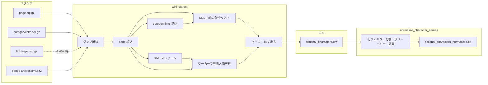
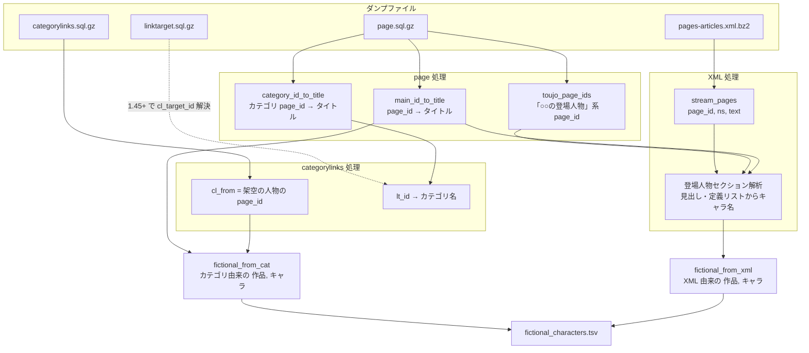
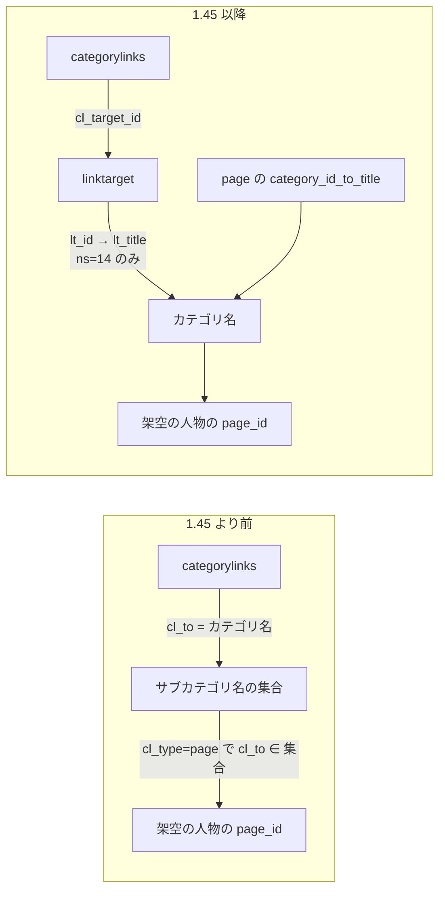
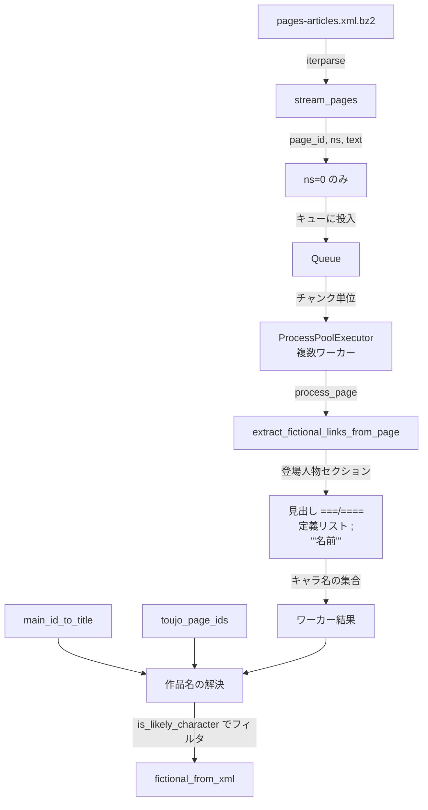
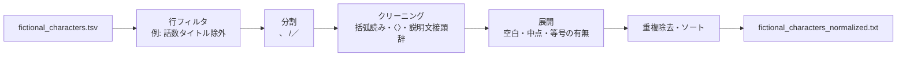

# 処理の詳細・各 Dump の役割

このドキュメントでは、パイプラインの処理内容と各ダンプファイルの役割・利用箇所を詳述します。

---

## 処理の流れ（パイプライン）

1. **ダンプの解決** … `data_dir` から必須3種（categorylinks, page, pages-articles）を検索し、linktarget は任意で検索。
2. **page ダンプ** … メイン名前空間の `page_id → タイトル`、カテゴリの `page_id → タイトル`、「○○の登場人物」系ページの `page_id` 集合を取得。
3. **categorylinks ダンプ** … 「架空の人物」カテゴリ配下の `page_id` を取得（1.45+ の場合は linktarget で `cl_target_id` → カテゴリ名を解決）。
4. **SQL 由来の架空リスト** … 上記 `page_id` に対応するタイトルを page の辞書で引き、`is_likely_character` でフィルタし、(作品名=「カテゴリ」, キャラ名) のペアを構築。
5. **pages-articles XML のストリーム** … 解凍しながら `iterparse` で各ページの `(page_id, ns, text)` を取得。ns=0 のページだけキューに投入。
6. **ワーカーで登場人物セクション解析** … 「登場人物」セクションを切り出し、見出し（===/====）と定義リスト（`;` 行）からキャラ名を抽出し、(作品名, キャラ名) を収集。作品名は page の「○○の登場人物」専用ページなら「の登場人物」を除去して取得。
7. **マージ・出力** … カテゴリ由来と XML 由来の (作品名, キャラ名) を結合し、`fictional_characters.tsv` を出力。
8. **正規化（別スクリプト）** … `scripts/normalize_character_names.py` で TSV を読み、行フィルタ・分割・クリーニング・展開ルールを適用し、1行1キャラ名の `fictional_characters_normalized.txt` を出力。

---

## 各 Dump ファイルの役割と使い方

### Dump とデータの流れ（全体像）

---

### 1. `page.sql.gz`（必須）

- **役割**  
  - メイン名前空間（ns=0）の **page_id → page_title** の対応（`main_id_to_title`）。  
  - カテゴリ名前空間（ns=14）の **page_id → page_title**（`category_id_to_title`）。  
  - 「○○の登場人物」「○○の登場人物一覧」「○○の主要な登場人物」など、タイトルが `.+の.+登場人物(_一覧)?$` にマッチするページの **page_id の集合**（`toujo_page_ids`）。

- **利用箇所**  
  - **wiki_extract/sql_page.py** の `run_page()` で `mwsql` によりダンプを1行ずつ読む。  
  - `page_namespace` で ns=0 / ns=14 を判別し、`page_title` を NFKC 正規化・空白をアンダースコアにした形で辞書に格納。  
  - メインの `__main__.py` では、  
    - カテゴリ由来の架空の人物の page_id からキャラ名を `main_id_to_title` で取得し、  
    - XML から得た page_id から「作品名」を、専用ページの場合は「の登場人物」を除いたタイトルで取得するのに `main_id_to_title` と `toujo_page_ids` を使用。

- **参照する列**  
  - `page_id`, `page_namespace`, `page_title`。

---

### 2. `categorylinks.sql.gz`（必須）

- **役割**  
  - 「架空の人物」カテゴリとそのサブカテゴリに属する **ページの page_id**（`cl_from`）を集める。  
  - MediaWiki のバージョンによって構造が異なる。  
    - **1.45 より前**: `cl_to` にカテゴリ名（文字列）が入る。  
    - **1.45 以降**: `cl_to` がなく `cl_target_id` のみ。この ID は **linktarget** テーブルの `lt_id` に対応するため、linktarget ダンプが別途必要。

- **利用箇所**  
  - **wiki_extract/sql_categorylinks.py** の `run_categorylinks()`。  
  - まず `page` から得た `category_id_to_title` で「架空の人物」の category page_id を解決。  
  - **cl_to がある場合**:  
    - `cl_type='subcat'` の行から「架空の人物」配下のカテゴリ名の集合を固定点で拡大し、  
    - `cl_type='page'` で `cl_to` がその集合に含まれるときの `cl_from` を架空の人物の page_id として収集。  
  - **cl_to がなく cl_target_id のみの場合**:  
    - **linktarget** ダンプを読み、ns=14 の行から `lt_id → カテゴリ名` の対応を取得。  
    - 「架空の人物」の category page_id と linktarget のカテゴリ名から、`lt_id → category page_id` の対応を組み立て、  
    - `cl_type='subcat'` でサブカテゴリの page_id 集合を固定点で拡大し、  
    - `cl_type='page'` で `cl_target_id` がその集合に属するときの `cl_from` を架空の人物の page_id として収集。

- **参照する列**  
  - `cl_from`, `cl_type`, `cl_to`（旧形式）, `cl_target_id`（1.45+ 形式）。

---

### 3. `linktarget.sql.gz`（必須）

- **役割**  
  - **categorylinks** の `cl_target_id` が指す ID と、カテゴリ名（ns=14 のタイトル）の対応を提供する。  
  - 現在の categorylinks ダンプは 1.45+ 形式（`cl_to` なし）のため、本ダンプで `lt_id` → カテゴリ名を解決しないと「架空の人物」配下の page_id を正しく集められない。

- **利用箇所**  
  - **wiki_extract/sql_categorylinks.py** の `_load_linktarget_category_titles()`。  
  - linktarget ダンプを開き、`lt_namespace=14` の行だけを対象に、`lt_id` → 正規化した `lt_title` の辞書を構築。  
  - 「架空の人物」がパースずれで取れない場合のフォールバックとして、`seed_titles=[CATEGORY_FICTIONAL]` で行内のいずれかのセルが「架空の人物」と一致すれば採用する処理あり。  
  - 得た `lt_id → カテゴリ名` と、page の `category_id_to_title` から「カテゴリ名 → category page_id」を組み、`cl_target_id` から category page_id を引けるようにする。

- **参照する列**  
  - `lt_id`, `lt_namespace`, `lt_title`。

- **配置**  
  - 必須。`data_dir` に `*linktarget*.sql.gz` を置く。未配置だと categorylinks 処理でエラーになる。

---

### 4. `pages-articles.xml.bz2`（または解凍済み `.xml`）（必須）

- **役割**  
  - 各ページの **最新リビジョンの本文（wikitext）** をストリームで渡す。  
  - 「○○の登場人物」専用ページや、通常記事中の「登場人物」セクションから、見出しと定義リスト（`;` 行）を解析してキャラクター名を抽出するための入力。

- **利用箇所**  
  - **wiki_extract/xml_stream.py** の `stream_pages()`。  
  - `.xml.bz2` の場合は `bz2.open`、解凍済みの場合は通常の `open` で開き、`xml.etree.ElementTree.iterparse` で `<page>` 単位に処理。  
  - 各 page から `id`（page_id）, `ns`, 最新 `<revision>` の `<text>` を取得し、`(page_id, ns, text)` を yield。メモリを抑えるため要素は都度 clear。  
  - **wiki_extract/__main__.py** では、別スレッドで `stream_pages()` を回し、ns=0 のページだけをキューに投入。  
  - **ProcessPoolExecutor** で **wiki_extract/xml_workers.process_page()** を呼び、**wiki_extract/section_arser** の `extract_fictional_links_from_page()` で、  
    - その page_id が「登場人物」専用ページ（`toujo_page_ids`）なら本文全体から、  
    - そうでなければ「登場人物」セクションを `extract_toujo_section()` で切り出したうえで、  
    - 見出し（===/====）と定義リスト（`;` 行）および `'''名前'''` 行からキャラ名を抽出し、リンク先タイトル（正規化）の集合を返す。  
  - 得たキャラ名は `is_likely_character()` でフィルタし、作品名は page の `main_id_to_title` と `toujo_page_ids` から「の登場人物」を除いたタイトルで解決し、(作品名, キャラ名) として `fictional_from_xml` に蓄積。

- **参照する要素**  
  - `page` → `id`, `ns`, `revision` → `text`（最後の revision のみ使用）。

---

## 出力ファイルの詳細

| ファイル | 生成元 | 内容 |
|----------|--------|------|
| **fictional_characters.tsv** | `python -m wiki_extract` | 1行目はヘッダー `作品名\tキャラクター名`。2行目以降はカテゴリ由来（作品名=「カテゴリ」）と XML 由来の (作品名, キャラ名) をアンダースコアをスペースに置換してソートして出力。 |
| **fictional_characters_normalized.txt** | `scripts/normalize_character_names.py` | 上記 TSV を入力に、行フィルタ（例: 話数タイトル除外）・「、」「/」での分割・括弧読み除去・説明文接頭辞除去・空白/中点/等号の展開を行い、キャラ名のみを1行1件で重複除去・ソートして出力。 |

---

## まとめ（Dump と処理の対応）

| Dump | 必須/任意 | 主な用途 |
|------|-----------|----------|
| **page.sql.gz** | 必須 | 全メイン/カテゴリの page_id↔タイトル、「○○の登場人物」系 page_id の取得。カテゴリ由来・XML 由来の両方で作品名・キャラ名の解決に使用。 |
| **categorylinks.sql.gz** | 必須 | 「架空の人物」カテゴリ配下の page_id（cl_from）の収集。cl_to または cl_target_id でカテゴリを特定。 |
| **linktarget.sql.gz** | 必須 | categorylinks の cl_target_id → カテゴリ名の解決。 |
| **pages-articles.xml(.bz2)** | 必須 | 本文のストリーム読み。「登場人物」セクション・専用ページからキャラ名を抽出し、(作品名, キャラ名) を生成。 |
