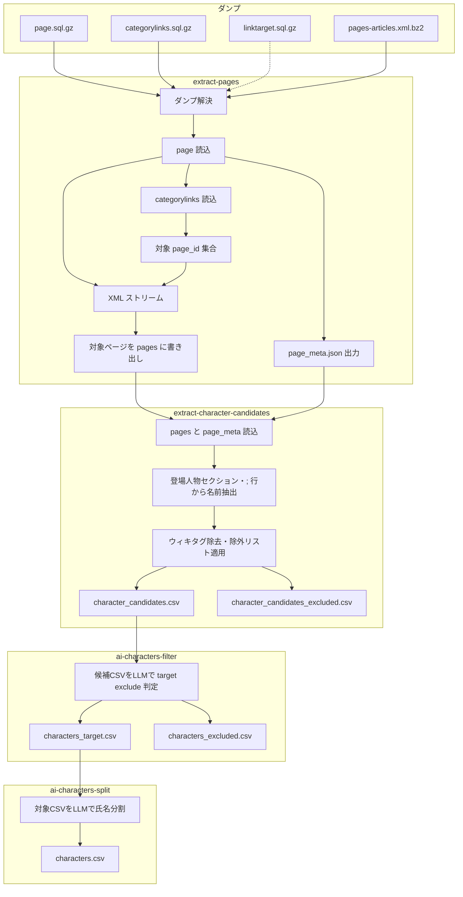
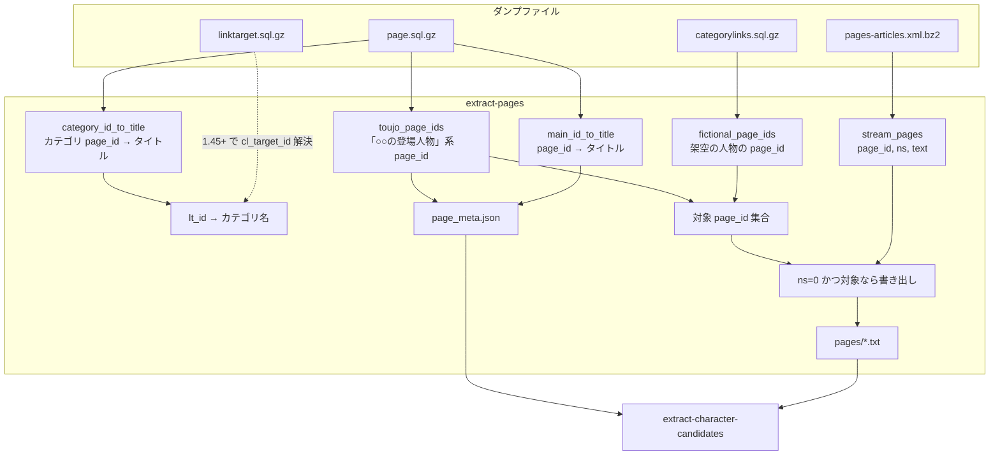
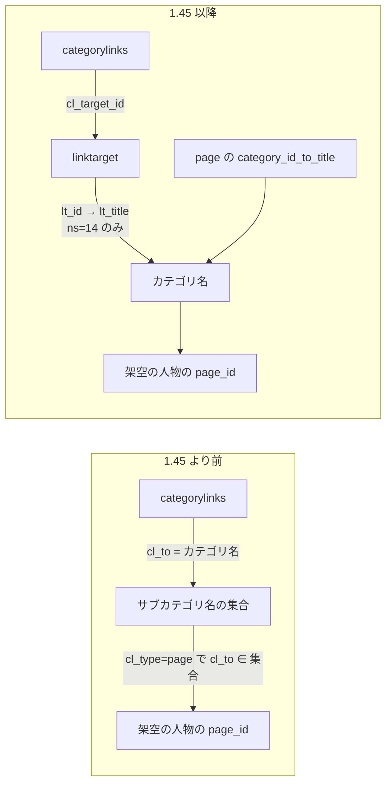
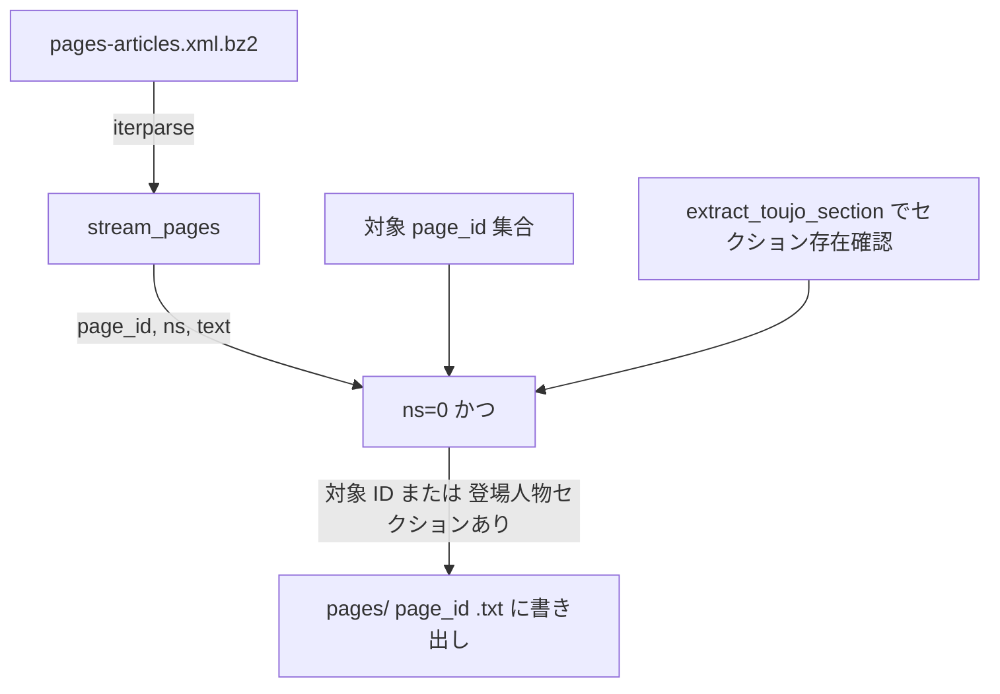

# 処理の詳細・各 Dump の役割

このドキュメントでは、パイプラインの処理内容と各ダンプファイルの役割・利用箇所を詳述します。

---

## 処理の流れ（パイプライン）

1. **extract-pages**  
   - **ダンプの解決** … `data_dir` から必須3種（categorylinks, page, pages-articles）を検索。linktarget は 1.45+ 形式の categorylinks の場合に必要で、任意検索。  
   - **page ダンプ** … メイン名前空間の `page_id → タイトル`、カテゴリの `page_id → タイトル`、「○○の登場人物」系ページの `page_id` 集合を取得。  
   - **categorylinks ダンプ** … 「架空の人物」カテゴリ配下の `page_id` を取得（1.45+ の場合は linktarget で `cl_target_id` → カテゴリ名を解決）。  
   - **対象 ID 集合** … 架空の人物の page_id ∪ 登場人物専用ページの page_id。さらに XML ストリーム時に「登場人物」セクションが存在する通常ページの page_id も対象に含める。  
   - **XML ストリーム** … 解凍しながら `iterparse` で各ページの `(page_id, ns, text)` を取得。ns=0 かつ「対象 ID に含まれる」または「本文に『登場人物』があり `extract_toujo_section` でセクションが取れる」ページのみ、`pages/{page_id}.txt` に書き出し。  
   - **page_meta.json** … `main_id_to_title` と `toujo_page_ids` を出力（extract-character-candidates で使用）。

2. **extract-character-candidates**  
   - **入力** … extract-pages の出力（`pages/` と `page_meta.json`）。  
   - **名前抽出** … 各ページについて、登場人物専用ページなら本文全体から、通常ページなら「登場人物」セクションを `extract_toujo_section` で切り出したうえで、`;` 行・`:*` 行からキャラ名候補を取得。ウィキテンプレート・リンク・脚注などを `clean_wiki_content` で除去し、「、」「/」で分割。  
   - **除外** … `excluded_names.json`（exact 完全一致・「の」+ exact 末尾一致）および `is_excluded_name` のルール（話数表記・声優クレジット等）で除外。該当は `character_candidates_excluded.csv` に取り分け。  
   - **出力** … `character_candidates.csv`（ページ名, 名前）。ai-characters-filter の入力。

3. **ai-characters-filter（①）**  
   - **入力** … `character_candidates.csv`。  
   - **処理** … 候補名をバッチで LLM（Ollama / Gemini 等）に送り、`data/prompts/filter_system.txt` に従って各名を「対象（固有名詞のキャラ名）」か「除外」に分類。ブラックリスト・強制除外・文断片判定・固有名詞らしさで status を補正。  
   - **出力** … `characters_target.csv`（対象）、`characters_excluded.csv`（除外）。再開時は進捗ファイルでスキップ可能。

4. **ai-characters-split（②）**  
   - **入力** … ①の `characters_target.csv`。  
   - **処理** … 対象名をバッチで LLM に送り、`data/prompts/split_system.txt` と few-shot 例（split_example_input / split_example_output）に従って「姓・名・氏名フラグ」に分割。  
   - **出力** … `characters.csv`（ページ名, キャラクター名, 姓, 名, 氏名フラグ）。再開時は進捗ファイルでスキップ可能。

---

## 各 Dump ファイルの役割と使い方

### Dump とデータの流れ（全体像）

---

### 1. `page.sql.gz`（必須）

- **役割**  
  - メイン名前空間（ns=0）の **page_id → page_title** の対応（`main_id_to_title`）。  
  - カテゴリ名前空間（ns=14）の **page_id → page_title**（`category_id_to_title`）。  
  - 「○○の登場人物」「○○の登場人物一覧」「○○の主要な登場人物」など、タイトルが `.+の.+登場人物(_一覧)?$` にマッチするページの **page_id の集合**（`toujo_page_ids`）。

- **利用箇所**  
  - **wiki_extract/extract/sql_page.py** の `run_page()` で `mwsql` によりダンプを1行ずつ読む。  
  - `page_namespace` で ns=0 / ns=14 を判別し、`page_title` を NFKC 正規化・空白をアンダースコアにした形で辞書に格納。  
  - **wiki_extract/extract/extract_pages.py** では、`main_id_to_title` と `toujo_page_ids` を `page_meta.json` に保存し、XML ストリームで「対象 page_id」に含まれるかどうかの判定に使用。  
  - **wiki_extract/characters/extract_character_candidates.py** では、`page_meta.json` から `main_id_to_title` と `toujo_page_ids` を読み、ページタイトル表示と「登場人物専用ページか通常ページか」の判定に使用。

- **参照する列**  
  - `page_id`, `page_namespace`, `page_title`。

---

### 2. `categorylinks.sql.gz`（必須）

- **役割**  
  - 「架空の人物」カテゴリとそのサブカテゴリに属する **ページの page_id**（`cl_from`）を集める。  
  - MediaWiki のバージョンによって構造が異なる。  
    - **1.45 より前**: `cl_to` にカテゴリ名（文字列）が入る。  
    - **1.45 以降**: `cl_to` がなく `cl_target_id` のみ。この ID は **linktarget** テーブルの `lt_id` に対応するため、linktarget ダンプが別途必要。

- **利用箇所**  
  - **wiki_extract/extract/sql_categorylinks.py** の `run_categorylinks()`。  
  - まず `page` から得た `category_id_to_title` で「架空の人物」の category page_id を解決。  
  - **cl_to がある場合**:  
    - `cl_type='subcat'` の行から「架空の人物」配下のカテゴリ名の集合を固定点で拡大し、  
    - `cl_type='page'` で `cl_to` がその集合に含まれるときの `cl_from` を架空の人物の page_id として収集。  
  - **cl_to がなく cl_target_id のみの場合**:  
    - **linktarget** ダンプを読み、ns=14 の行から `lt_id → カテゴリ名` の対応を取得。  
    - 「架空の人物」の category page_id と linktarget のカテゴリ名から、`lt_id → category page_id` の対応を組み立て、  
    - `cl_type='subcat'` でサブカテゴリの page_id 集合を固定点で拡大し、  
    - `cl_type='page'` で `cl_target_id` がその集合に属するときの `cl_from` を架空の人物の page_id として収集。

- **参照する列**  
  - `cl_from`, `cl_type`, `cl_to`（旧形式）, `cl_target_id`（1.45+ 形式）。

---

### 3. `linktarget.sql.gz`（1.45+ 形式の categorylinks の場合は必須）

- **役割**  
  - **categorylinks** の `cl_target_id` が指す ID と、カテゴリ名（ns=14 のタイトル）の対応を提供する。  
  - 現在の categorylinks ダンプが 1.45+ 形式（`cl_to` なし）の場合、本ダンプで `lt_id` → カテゴリ名を解決しないと「架空の人物」配下の page_id を正しく集められない。

- **利用箇所**  
  - **wiki_extract/extract/sql_categorylinks.py** の `_load_linktarget_category_titles()`。  
  - linktarget ダンプを開き、`lt_namespace=14` の行だけを対象に、`lt_id` → 正規化した `lt_title` の辞書を構築。  
  - 「架空の人物」がパースずれで取れない場合のフォールバックとして、`seed_titles=[CATEGORY_FICTIONAL]` で行内のいずれかのセルが「架空の人物」と一致すれば採用する処理あり。  
  - 得た `lt_id → カテゴリ名` と、page の `category_id_to_title` から「カテゴリ名 → category page_id」を組み、`cl_target_id` から category page_id を引けるようにする。

- **参照する列**  
  - `lt_id`, `lt_namespace`, `lt_title`。

- **配置**  
  - 1.45+ 形式の categorylinks を使用する場合は必須。`data_dir` に `*linktarget*.sql.gz` を置く。未配置だと categorylinks 処理でエラーになる。旧形式（cl_to あり）の場合は不要。

---

### 4. `pages-articles.xml.bz2`（または解凍済み `.xml`）（必須）

- **役割**  
  - 各ページの **最新リビジョンの本文（wikitext）** をストリームで渡す。  
  - extract-pages では、対象 page_id に含まれるページ、または「登場人物」セクションが存在する通常ページの本文を `pages/{page_id}.txt` に書き出すための入力。

- **利用箇所**  
  - **wiki_extract/extract/xml_stream.py** の `stream_pages()`。  
  - `.xml.bz2` の場合は `bz2.open`、解凍済みの場合は通常の `open` で開き、`xml.etree.ElementTree.iterparse` で `<page>` 単位に処理。  
  - 各 page から `id`（page_id）, `ns`, 最新 `<revision>` の `<text>` を取得し、`(page_id, ns, text)` を yield。メモリを抑えるため要素は都度 clear。  
  - **wiki_extract/extract/extract_pages.py** では、`stream_pages()` で ns=0 のページを走査し、page_id が対象集合に含まれる場合はそのまま `pages/{page_id}.txt` に書き出し。含まれない場合は本文に「登場人物」が含まれるときだけ **wiki_extract/extract/section_parser.py** の `extract_toujo_section()` でセクションの有無を確認し、あれば同様に書き出す。

- **参照する要素**  
  - `page` → `id`, `ns`, `revision` → `text`（最後の revision のみ使用）。

---

## 出力ファイルの詳細

| ファイル / ディレクトリ | 生成元 | 内容 |
|------------------------|--------|------|
| **pages/** | `extract-pages` | 対象ページの Wiki ソースを 1 ページ 1 ファイル（`{page_id}.txt`）で出力。架空の人物カテゴリ・登場人物専用ページ・「登場人物」セクションがある通常ページが対象。 |
| **page_meta.json** | `extract-pages` | `main_id_to_title`（page_id → タイトル）、`toujo_page_ids`（登場人物専用ページの page_id リスト）。extract-character-candidates でページ名表示と専用ページ判定に使用。 |
| **character_candidates.csv** | `extract-character-candidates` | ヘッダー `ページ名,名前`。登場人物セクション・`;` 行などから抽出したキャラ名候補。除外リスト・話数・声優表記等で除外したものは含めず、該当は character_candidates_excluded.csv に取り分け。 |
| **character_candidates_excluded.csv** | `extract-character-candidates` | ヘッダー `ページ名,名前`。除外ルールに該当した（ページ名, 名前）の取り分け用 CSV。character_candidates.csv と同階層に出力。 |
| **characters_target.csv** | `ai-characters-filter` | ヘッダー `ページ名,名前`。LLM で「対象（キャラクター名として採用）」と判定した行。ai-characters-split の入力。 |
| **characters_excluded.csv** | `ai-characters-filter` | ヘッダー `ページ名,名前`。LLM で「除外」と判定した行。 |
| **characters.csv** | `ai-characters-split` | ヘッダー `ページ名,キャラクター名,姓,名,氏名フラグ`。対象 CSV を LLM で氏名分割した結果。1 行 1 キャラクター。 |

---

## 補足: 登場人物候補の抽出ロジック（extract-character-candidates）

- **wiki_extract/characters/extract_character_candidates.py** では、  
  - 登場人物専用ページ（`toujo_page_ids` に含まれる page_id）: 本文全体を **get_names_for_toujo_page** に渡し、`;` で始まる行の内容を `clean_wiki_content` でクリーニングしたうえで、「、」「/」で分割して候補とする。  
  - 通常ページ: **get_names_for_normal_page** で、まず **wiki_extract/extract/section_parser.py** の `extract_toujo_section()` で「登場人物」セクションを切り出し、同様に `;` 行・`:*` 行から候補を取得。  
- ウィキのテンプレート（efn, Ruby, 読み仮名, 仮リンク, ref, lang 系など）・リンク・脚注・声優・演者表記の除去は `clean_wiki_content` および `is_excluded_name` で実施。

---

## まとめ（Dump と処理の対応）

| Dump | 必須/任意 | 主な用途 |
|------|-----------|----------|
| **page.sql.gz** | 必須 | 全メイン/カテゴリの page_id↔タイトル、「○○の登場人物」系 page_id の取得。extract-pages で対象判定と page_meta.json に使用。extract-character-candidates でページ名・専用ページ判定に使用。 |
| **categorylinks.sql.gz** | 必須 | 「架空の人物」カテゴリ配下の page_id（cl_from）の収集。cl_to または cl_target_id でカテゴリを特定。 |
| **linktarget.sql.gz** | 1.45+ 時必須 | categorylinks の cl_target_id → カテゴリ名の解決。 |
| **pages-articles.xml(.bz2)** | 必須 | 本文のストリーム読み。extract-pages で対象ページの wikitext を pages/*.txt に書き出すための入力。 |
